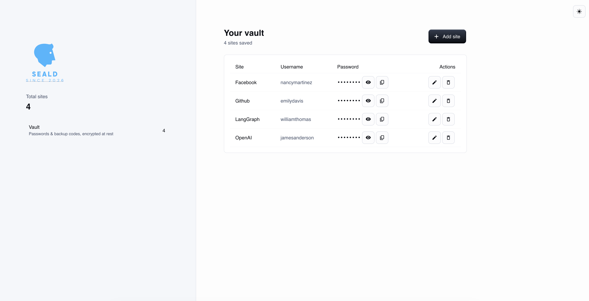

# Seald

[](https://github.com/vajapravin/seald/actions/workflows/ci.yml)


A self-hosted password and backup-code manager. Seald keeps your site credentials
and 2FA recovery codes in one place, encrypted at rest, on infrastructure **you**
control. Built with a FastAPI backend, a React single-page app based on the
Material UI design system, and Supabase (PostgreSQL) for storage — all wired
together with Docker Compose so it runs anywhere with two commands.



## 🏗 Architecture

The application separates concerns across three layers, so each piece can evolve
(or be swapped) independently:

1. **React SPA (frontend)** — a two-panel interface served by nginx: brand and
   vault summary on the left, your sites on the right. All API traffic is
   proxied through nginx to the backend, so the browser only ever talks to one
   origin.
2. **FastAPI backend** — exposes a versioned REST API (`/api/v1`). Routes handle
   HTTP and encryption only; storage sits behind a **repository interface**,
   with a Supabase implementation in production and an in-memory one for tests.
3. **Encryption layer** — every password and backup code is encrypted with
   **Fernet (AES-CBC + HMAC, authenticated encryption)** before it leaves the
   backend process. The database only ever stores ciphertext. Keys support
   rotation via `MultiFernet` — new writes use the newest key while old data
   remains readable.
4. **Supabase (PostgreSQL)** — persistence with Row Level Security enabled.
   Schema is version-controlled as SQL migrations in `supabase/migrations/`.

## ✨ Core Features

- **Vault dashboard** — all saved sites at a glance with masked passwords,
  show/hide toggle, and one-click copy to clipboard.
- **Add / edit / remove sites** — each entry stores the site, username,
  password, free-form notes, and 2FA backup codes; deletion asks for
  confirmation.
- **Cryptographically secure password generator** — built on Python's `secrets`
  CSPRNG with guaranteed character-class coverage, optional ambiguous-character
  exclusion, and a live strength rating (zxcvbn) showing estimated crack time.
- **Backup-code generator** — creates 2FA-style recovery codes
  (e.g. `A3F9-K2M7`) in one click.
- **Encryption at rest** — Fernet authenticated encryption for every secret;
  key rotation supported out of the box.
- **Light & dark mode** — full theme toggle, persisted across visits.
- **Self-contained deployment** — one `docker compose up` brings up the whole
  stack; nginx serves the SPA and proxies the API.

## 🔒 How Seald protects your data

- **Encrypted at rest.** Secrets are encrypted in the backend before storage.
  A leaked database dump, a compromised Supabase dashboard, or a stolen backup
  yields only ciphertext.
- **Authenticated encryption.** Fernet includes an HMAC — tampered ciphertext
  is detected and rejected, never silently decrypted into garbage.
- **Key custody stays with you.** The encryption key lives in your `.env` on
  your server, never in the database and never in the repository.
- **Least-privilege configuration.** Only the backend container receives
  database credentials; the frontend container holds no secrets at all.
  Row Level Security is enabled on the database.
- **No telemetry, no third parties.** Seald makes no outbound calls except to
  your own Supabase instance. Nothing is phoned home, analyzed, or sold.

> ⚠️ **Honest scope note:** Seald does not yet include user authentication —
> anyone who can reach the backend port can use the API. Run it only on
> networks you control (localhost, home lab, VPN such as Tailscale/WireGuard)
> until the auth milestone lands. See the roadmap below.

## 🤔 Why Seald instead of a third-party password manager?

Commercial managers (1Password, LastPass, Dashlane, …) are excellent products —
but they come with trade-offs that self-hosting removes.

**Pros of Seald**

- **Your data never leaves your infrastructure.** Third-party managers are
  high-value targets precisely because they aggregate millions of vaults —
  LastPass's 2022 breach exposed customer vault backups. Seald's blast radius
  is one user: you.
- **Zero cost, forever.** No subscription, no seat licenses, no feature
  paywalls. Supabase's free tier comfortably covers personal use.
- **Full auditability.** Every line of code is in this repository. You don't
  have to trust marketing claims about encryption — you can read
  `backend/app/core/crypto.py` yourself.
- **No vendor lock-in.** Your data sits in a plain PostgreSQL table you own.
  Export it with one SQL query; decrypt it with your key.
- **Backup codes as a first-class feature.** Most managers treat 2FA recovery
  codes as an afterthought; Seald stores them alongside each site's credentials.

**Cons (equally honest)**

- **You are the security team.** Updates, server hardening, key backups, and
  database backups are your responsibility. A forgotten encryption key means
  permanently lost data — by design.
- **No auth yet** — see the scope note above; commercial products ship MFA,
  sharing, and breach monitoring today.
- **No browser extension or autofill.** Copy/paste workflow only, for now.
- **No sync clients** — it's a web app; there are no native mobile apps.
- **Community of one.** No support hotline, no SOC 2 report, no bug bounty
  program backing it.

If you want zero-maintenance convenience, buy a commercial manager. If you want
ownership, transparency, and zero cost — and you're comfortable running Docker —
Seald is for you.

## 🚀 Installation

**Prerequisites:** Docker with Compose, a free [Supabase](https://supabase.com)
project, and Python 3.12+ (only for generating the encryption key).

```bash
# 1. Clone
git clone https://github.com/vajapravin/seald.git
cd seald

# 2. Configure the backend
cp backend/.env.example backend/.env
# Fill in from your Supabase project (Settings → API):
#   SUPABASE_URL, SUPABASE_SERVICE_ROLE_KEY
# Generate the encryption key and paste it as ENCRYPTION_KEYS:
python -c "from cryptography.fernet import Fernet; print(Fernet.generate_key().decode())"

# 3. Create the database schema
#    Open your Supabase project → SQL Editor → run the contents of
#    supabase/migrations/*.sql

# 4. Launch
docker compose up --build -d
```

Then open:

| URL | What |
|---|---|
| http://localhost:3000 | The Seald web app |
| http://localhost:8000/docs | Interactive API documentation |
| http://localhost:8000/health | Backend health check |

> 🔑 **Back up your `ENCRYPTION_KEYS` value somewhere safe and separate from
> the database.** Losing it means losing every stored secret, permanently.
> That is the point of encryption — there is no recovery path.

## 🧪 Development

```bash
# Backend tooling (lint, types, tests)
pip install -r backend/requirements-dev.txt
ruff check backend/ && ruff format --check backend/
cd backend && pytest

# Frontend with hot reload (backend must be running on :8000)
cd frontend && npm install && npm run dev
```

Every push and pull request runs the full gate — ruff, mypy, pytest, and the
frontend build — in GitHub Actions. `main` is protected: changes land only
through pull requests with green checks.

## 🗺 Roadmap

- [ ] **Authentication & row-level security** — multi-user support with
  per-user vault isolation (next milestone)
- [ ] Dashboard search, filtering, and sorting
- [ ] End-to-end encryption (client-side, zero-knowledge)
- [ ] Vault export & encrypted backups
- [ ] Browser extension

## 📄 License

MIT — see [LICENSE](LICENSE). Use it, fork it, self-host it.
