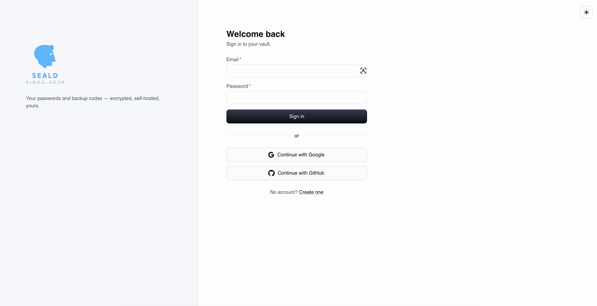
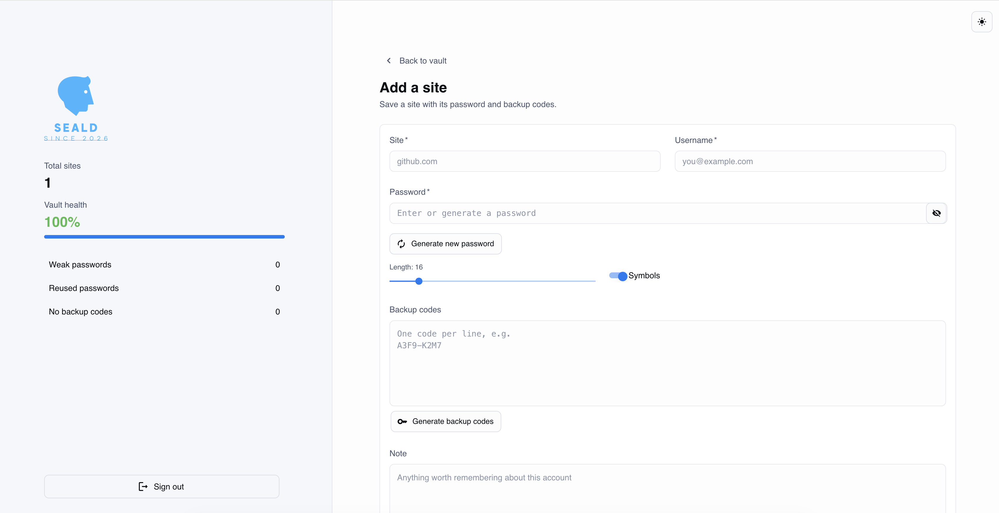
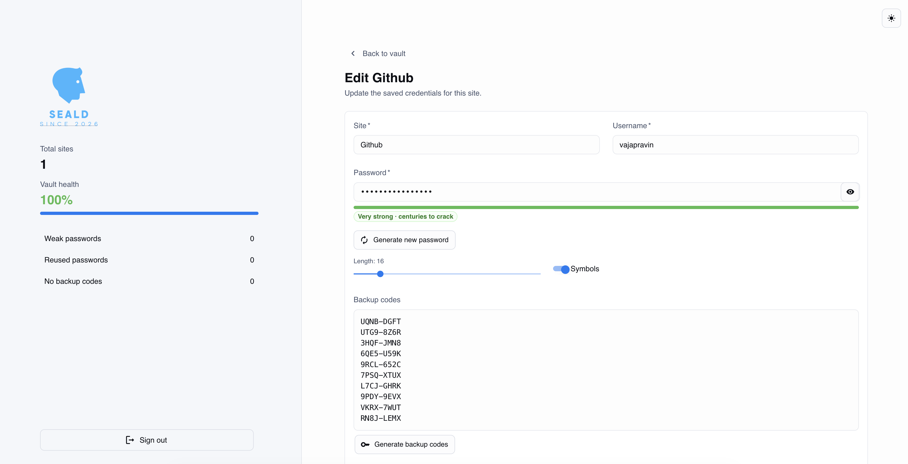

# Seald

[](https://github.com/vajapravin/seald/actions/workflows/ci.yml)


A self-hosted, multi-user password and backup-code manager. Seald keeps each
user's site credentials and 2FA recovery codes in one place, encrypted at rest,
on infrastructure **you** control. Built with a FastAPI backend, a React
single-page app based on the Material UI design system, and Supabase
(PostgreSQL + Auth) — wired together with Docker Compose so it runs anywhere
with two commands.


## 📸 Screens

<table>
  <tr>
    <td width="50%" align="center">
      
      <br /><sub><b>Sign in</b> — email/password or continue with Google or GitHub</sub>
    </td>
    <td width="50%" align="center">
      
      <br /><sub><b>Vault dashboard</b> — searchable, sortable, with masked passwords and live vault health</sub>
    </td>
  </tr>
  <tr>
    <td width="50%" align="center">
      
      <br /><sub><b>Add a site</b> — generate strong passwords and backup codes in one place</sub>
    </td>
    <td width="50%" align="center">
      
      <br /><sub><b>Edit a site</b> — live strength meter with estimated crack time</sub>
    </td>
  </tr>
</table>

## 🏗 Architecture

Seald separates concerns across clear layers, so each can evolve independently:

1. **React SPA (frontend)** — a two-panel interface served by nginx: brand and
   vault health on the left, your sites on the right. Authentication is handled
   by the Supabase JS client; every API call carries the user's JWT.
2. **FastAPI backend** — a versioned REST API (`/api/v1`). It verifies the
   Supabase-issued JWT on every request, extracts the user, and scopes all data
   access to that user. Routes handle HTTP and encryption; storage sits behind a
   repository interface.
3. **Authentication (Supabase Auth)** — email/password with mandatory email
   confirmation, plus Google and GitHub social login. Sessions and token refresh
   are managed client-side; the backend verifies token signatures against the
   project's public keys (JWKS).
4. **Encryption layer** — every password and backup code is encrypted with
   **Fernet (authenticated encryption)** before it leaves the backend. The
   database only ever stores ciphertext. Keys support rotation.
5. **Supabase (PostgreSQL)** — per-user persistence. Every vault entry is linked
   to its owner, protected by **Row Level Security** as a database-level
   backstop in addition to backend filtering. Schema lives as SQL migrations in
   `supabase/migrations/`.

## ✨ Core Features

- **Multi-user accounts** — register with email and password (email confirmation
  required), or sign in with Google or GitHub. Each user has a private vault.
- **Per-user vault isolation** — enforced both in the backend (every query
  scoped to the authenticated user) and in the database (Row Level Security).
- **Vault dashboard** — a searchable, sortable table of all saved sites with
  masked passwords, show/hide, and one-click copy for username and password.
- **Vault health summary** — at-a-glance score plus counts of weak passwords,
  reused passwords, and sites missing backup codes.
- **Add / edit / remove sites** — site, username, password, notes, and 2FA
  backup codes per entry; deletion asks for confirmation.
- **Secure password generator** — built on Python's `secrets` CSPRNG with
  adjustable length, a symbols toggle, and a live strength meter (zxcvbn)
  showing estimated crack time as you type.
- **Backup-code generator** — creates 2FA-style recovery codes in one click.
- **Encryption at rest** — Fernet authenticated encryption for every secret.
- **Light & dark mode** — full theme toggle.
- **Self-contained deployment** — one `docker compose up` brings up the stack.

## 🔒 How Seald protects your data

- **Authentication on every request.** The backend rejects any request without a
  valid, signature-verified Supabase JWT. Nothing in the vault is reachable
  unauthenticated.
- **Per-user isolation, defense in depth.** The backend filters every query by
  the authenticated user, and Postgres Row Level Security independently prevents
  one user's rows from being returned to another — even a backend bug can't leak
  across users.
- **Encrypted at rest.** Secrets are encrypted in the backend before storage. A
  leaked database dump, a compromised dashboard, or a stolen backup yields only
  ciphertext.
- **Authenticated encryption.** Fernet includes an HMAC — tampered ciphertext is
  detected and rejected, never silently decrypted.
- **Key custody stays with you.** The encryption key lives in your backend `.env`
  on your server, never in the database and never in the repository.
- **Least-privilege configuration.** Only the backend holds database and signing
  credentials; the frontend holds only the public Supabase anon key.
- **No telemetry, no third parties.** Seald makes no outbound calls except to
  your own Supabase instance.

## 🤔 Why Seald instead of a third-party password manager?

Commercial managers (1Password, LastPass, Dashlane, …) are excellent products —
but self-hosting removes trade-offs they can't.

**Pros of Seald**

- **Your data never leaves your infrastructure.** Third-party managers aggregate
  millions of vaults, which makes them high-value targets — LastPass's 2022
  breach exposed customer vault backups. Seald's blast radius is your own users.
- **Zero cost.** No subscription, no seat licenses, no feature paywalls.
  Supabase's free tier comfortably covers personal and small-team use.
- **Full auditability.** Every line is in this repository. You don't have to
  trust claims about the encryption — you can read `backend/app/core/crypto.py`.
- **No vendor lock-in.** Your data sits in a PostgreSQL table you own.
- **Backup codes as a first-class feature.** Most managers treat 2FA recovery
  codes as an afterthought; Seald stores them alongside each site.

**Cons (equally honest)**

- **You are the security team.** Updates, server hardening, key backups, and
  database backups are your responsibility. A lost encryption key means
  permanently lost data — by design.
- **No browser extension or autofill.** Copy/paste workflow only, for now.
- **No native mobile or sync clients** — it's a web app.
- **Community of one.** No support hotline, no SOC 2 report, no bug bounty.

If you want zero-maintenance convenience, buy a commercial manager. If you want
ownership, transparency, and zero cost — and you're comfortable running Docker —
Seald is for you.

## 🚀 Installation

**Prerequisites:** Docker with Compose, a free [Supabase](https://supabase.com)
project, and Python 3.12+ (only to generate the encryption key).

### 1. Clone

```bash
git clone https://github.com/vajapravin/seald.git
cd seald
```

### 2. Set up the database

In your Supabase project's SQL Editor, run the migrations in
`supabase/migrations/` in order. This creates the `sites` table, links it to
users, and enables Row Level Security.

### 3. Configure authentication (Supabase dashboard)

- **Authentication → Providers → Email:** enable it and turn **Confirm email ON**.
- **Authentication → URL Configuration:** add `http://localhost:3000` to the
  Site URL and the Redirect URLs allowlist (include
  `http://localhost:3000/auth/callback`).
- **Social login (optional):** enable Google and/or GitHub under
  **Authentication → Providers**, using OAuth apps whose callback URL is your
  project's `https://<ref>.supabase.co/auth/v1/callback`.

### 4. Configure the backend

```bash
cp backend/.env.example backend/.env
```

Fill in `backend/.env`:

```
SUPABASE_URL=https://<your-project-ref>.supabase.co
SUPABASE_SERVICE_ROLE_KEY=<service role key>   # Settings -> API
STORAGE_BACKEND=supabase

# Generate with:
# python -c "from cryptography.fernet import Fernet; print(Fernet.generate_key().decode())"
ENCRYPTION_KEYS=<generated key>

# Legacy - only used if your project signs JWTs with the older HS256 secret.
# Projects using asymmetric (ES256) keys verify via JWKS and don't need this.
SUPABASE_JWT_SECRET=
```

### 5. Configure the frontend

```bash
cp frontend/.env.example frontend/.env
```

Fill in `frontend/.env` (both values are public-safe):

```
VITE_SUPABASE_URL=https://<your-project-ref>.supabase.co
VITE_SUPABASE_ANON_KEY=<anon key>   # Settings -> API
```

### 6. Launch

```bash
docker compose up --build -d
```

Then open:

| URL | What |
|---|---|
| http://localhost:3000 | The Seald web app (register or sign in to start) |
| http://localhost:8000/docs | Interactive API documentation |
| http://localhost:8000/health | Backend health check |

> 🔑 **Back up your `ENCRYPTION_KEYS` value somewhere safe and separate from the
> database.** Losing it means losing every stored secret, permanently. That is
> the point of encryption — there is no recovery path.

## 🧪 Development

```bash
# Backend tooling (lint, types, tests)
pip install -r backend/requirements-dev.txt
ruff check backend/ && ruff format --check backend/
cd backend && pytest

# Frontend with hot reload (backend must be running on :8000)
cd frontend && npm install && npm run dev
```

Every push and pull request runs the full gate — ruff, mypy, pytest, and the
frontend build — in GitHub Actions. `main` is protected: changes land only
through pull requests with green checks.

## 🗺 Roadmap

- [ ] Account-level 2FA (TOTP) for the Seald login itself, toggleable in settings
- [ ] Dashboard filtering and column improvements
- [ ] Encrypted vault export & import
- [ ] Breach checking (HaveIBeenPwned, k-anonymity)
- [ ] End-to-end encryption (client-side, zero-knowledge)

## 📄 License

MIT — see [LICENSE](LICENSE). Use it, fork it, self-host it.
